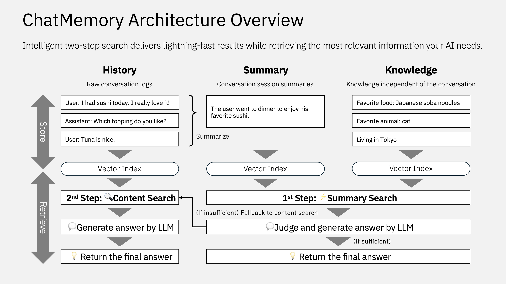

# ChatMemory

The simple yet powerful long-term memory manager between AI and you💕


## ✨ Features

- **🌟 Extremely simple:** All code is contained in one file, making it easy to track memory management—just PostgreSQL is needed as your datastore.
- **🔎 Intelligent Search & Answer:** Quickly retrieves context via vector search on summaries/knowledge, then uses detailed history if needed—returning both the answer and raw data.
- **💬 Direct Answer:** Leverages an LLM to produce clear, concise answers that go beyond mere data retrieval, delivering ready-to-use responses.




## 🐳 Quick start (Docker)

```sh
git clone https://github.com/uezo/chatmemory
cd chatmemory/docker
cp .env.sample .env
```

Set `OPENAI_API_KEY` to `.env`, then start the container.

```sh
docker compose up
```

Go http://127.0.0.1:8000/docs to know the spec and try the APIs.

**NOTE:** On the first run, the `chatmemory-app` container may fail to start. This happens because the application server tries to access the database before it is fully initialized. Restarting the `chatmemory-app` container will resolve this issue.


## 🚀 Quick start

**Pre-requirements:**

- Python 3.10 or later
- PostgreSQL (Tested on version 16) is up
- pgvector is installed


Install chatmemory.

```sh
pip install chatmemory
```

Create the server script (e.g.`server.py`) as following:

```python
from fastapi import FastAPI
from chatmemory import ChatMemory

cm = ChatMemory(
    openai_api_key="YOUR_OPENAI_API_KEY",
    llm_model="gpt-4o",
    # Your PostgreSQL configurations
    db_name="postgres",
    db_user="postgres",
    db_password="postgres",
    db_host="127.0.0.1",
    db_port=5432,
)

app = FastAPI()
app.include_router(cm.get_router())
```

Start API server.

```sh
uvicorn server:app
```

That's all. Long-term memory management service is ready-to-use👍

Go http://127.0.0.1:8000/docs to know the spec and try the APIs.


## 🧩 REST API Usage

Below is a complete Python sample demonstrating how to interact with the ChatMemory REST API. This sample uses the `requests` library to:

1. Add conversation messages.
2. Simulate a session change (which triggers automatic summary generation for the previous session).
3. Retrieve the generated summary.
4. Perform a search to obtain an answer (with retrieved raw data).

```python
import requests
import time

BASE_URL = "http://localhost:8000"  # Change if your API runs on a different host/port

# Unique identifiers for testing
user_id = "test_user_123"
session1 = "session_1"
session2 = "session_2"

# Step 1: Add messages to the first session
history_payload1 = {
    "user_id": user_id,
    "session_id": session1,
    "messages": [
        {"role": "user", "content": "I like Japanese soba noodle."},
        {"role": "assistant", "content": "How often do you eat?"},
        {"role": "user", "content": "Everyday."},
        {"role": "assistant", "content": "You really love it."}
    ]
}

response = requests.post(f"{BASE_URL}/history", json=history_payload1)
print("Added history for session1:", response.json())

# Wait a short moment (if needed) for processing
time.sleep(1)

# Step 2: Simulate a session change by adding messages to a new session
# This should trigger automatic summary generation for session1
history_payload2 = {
    "user_id": user_id,
    "session_id": session2,
    "messages": [
        {"role": "user", "content": "What's the weather like today? I go to shopping to Shibuya."},
        {"role": "assistant", "content": "It looks sunny outside!"}
    ]
}

response = requests.post(f"{BASE_URL}/history", json=history_payload2)
print("Added history for session2:", response.json())

# Optionally, wait for the background summary to be generated
print("Waiting for summary generation... (5 seconds)")
time.sleep(5)

# Step 3: Retrieve the summary for session1
params = {"user_id": user_id, "session_id": session1}
response = requests.get(f"{BASE_URL}/summary", params=params)
print("Summary for session1:", response.json())

# Step 4: Perform a search to retrieve an answer based on the stored memory
query = "What is the favorite food?"
search_payload = {
    "user_id": user_id,
    "query": query,
    "top_k": 3,
    "search_content": True,
    "include_retrieved_data": True
}

response = requests.post(f"{BASE_URL}/search", json=search_payload)
print("Search result:", response.json())

answer = response.json()["result"]["answer"]
print("===========")
print(f"Query: {query}")
print(f"Answer: {answer}")
```

Run it.

```sh
python client.py
Added history for session1: {'status': 'ok'}
Added history for session2: {'status': 'ok'}
Waiting for summary generation... (5 seconds)
Summary for session1: {'summaries': [{'created_at': '2025-02-25T18:11:22.895354', 'session_id': 'session_1', 'summary': "In a conversation, the user expresses their fondness for Japanese soba noodles, mentioning that they eat them every day. The assistant acknowledges the user's enthusiasm for the dish. \n\nKeywords: Japanese soba noodles, frequency, everyday."}]}
Search result: {'result': {'answer': "The user's favorite food is Japanese soba noodles, which they mention eating every day.", 'retrieved_data': "====\n\nConversation summary (2025-02-25 18:11:22.895354): In a conversation, the user expresses their fondness for Japanese soba noodles, mentioning that they eat them every day. The assistant acknowledges the user's enthusiasm for the dish. \n\nKeywords: Japanese soba noodles, frequency, everyday.\n\n"}}
===========
Query: What is the favorite food?
Answer: The user's favorite food is Japanese soba noodles, which they mention eating every day.
```


## 🪄 How it works

ChatMemory organizes conversation data into three primary entities:

- **📜 History:** The raw conversation logs, storing every message exchanged.
- **📑 Summary:** A concise overview generated from the detailed history using an LLM. This enables fast, lightweight processing by capturing the essence of a conversation.
- **💡 Knowledge:** Additional, explicitly provided information that isn’t tied to the conversation log. This allows you to control and influence the answer independently.

When a search query is received, ChatMemory works in two stages:

1. **⚡ Lightweight Retrieval:** It first performs a vector-based search on the summaries and knowledge. This step quickly gathers relevant context and typically suffices for generating an answer.
2. **🔍 Fallback Detailed Search:** If the initial results aren’t deemed sufficient, ChatMemory then conducts a vector search over the full conversation history. This retrieves detailed logs, enabling the system to refine and improve the answer.

This two-step mechanism strikes a balance between speed and accuracy—leveraging the efficiency of summaries while still ensuring high-precision answers when more context is needed. Additionally, the explicit knowledge you provide helps guide the responses beyond just the conversation history.


## ❓ FAQ

### Will there be support for models other than OpenAI?

No! I want to keep things as simple as possible, and adding support for other models would make maintenance more challenging. However, if you override the two functions — `llm` and `embed` — you can adapt it to work with other LLMs, so feel free to give it a try! Also, you might consider using a solution like LiteLLM; I personally use it!

https://github.com/BerriAI/litellm

### How do I integrate this with my chatbot?

Since fetching the entire memory every time could slow down responses and introduce unnecessary noise, it’s better to retrieve the memory only when needed for search and retrieval. Consider implementing the API call as a function call (or tool call) within your chatbot.

### Is the data used in the second step solely from the conversation logs?

Not at all — the response generation uses not only the detailed conversation logs but also the summary information obtained in the first step, along with any additional knowledge provided.

### Is the Knowledge updated automatically?

At the moment, it isn’t. Even during ongoing conversations, the Knowledge doesn’t grow on its own, so you’ll need to implement an update process through some operation. In the future, it would be great if important details from the conversation could automatically be "elevated" into Knowledge. If you manage to come up with a neat solution, feel free to submit a Pull Request!
